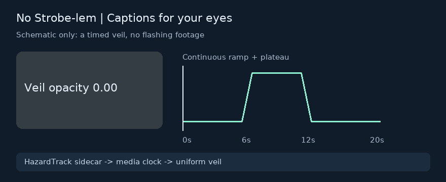
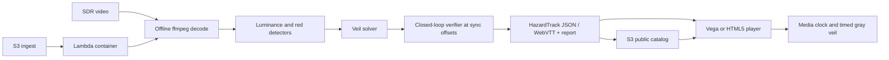

# No Strobe-lem

Captions for your eyes: analyze SDR video once, then carry a verified, timed veil to a Vega or web player with HazardTrack sidecars.



This schematic shows continuous veil ramps and timing, with no source-video frames. The [Vega demo](tv/README.md) uses an attributed excerpt with no detected FAIL events; its Broadcast/Local cue is illustrative, and Kids suppresses detected warnings.

## Runtime hook

| Technology | Exact runtime files | What happens |
|---|---|---|
| Vega W3C media | [`tv/src/player/VegaW3CPlayer.ts`](tv/src/player/VegaW3CPlayer.ts), [`VideoSurface.tsx`](tv/src/player/VideoSurface.tsx) | Imports `@amazon-devices/react-native-w3cmedia`, awaits `VideoPlayer.initialize()` before setting `src`, attaches `KeplerVideoSurfaceView` and forwards native events. |
| Playback veil | [`tv/src/veil/VeilLayer.tsx`](tv/src/veil/VeilLayer.tsx), [`mediaClock.ts`](tv/src/veil/mediaClock.ts), [`scheduler.ts`](tv/src/veil/scheduler.ts) | Drift-corrected media time drives a native gray overlay above the video; seeks stay covered until the destination veil is primed. |
| Lambda / S3 | [`infra/template.yaml`](infra/template.yaml), [`handler.py`](infra/lambda/handler.py), [`pipeline.py`](infra/lambda/pipeline.py) | An `ingest/*.mp4` upload invokes the container pipeline; all profiles must verify before video, sidecars, report and catalog are published under `public/`. |

The Release app builds and runs on the **Vega Virtual Device (VVD)**. Timing and compositing were measured on SDK 0.24.12112 / CLI 1.4.2, W3C Media 2.3.2. The S8 functional rerun and release status are in [S8_REPORT.md](docs/S8_REPORT.md). AWS packaging and local integration are tested; a live AWS deployment remains unverified.

## Quickstart

Requirements: Python 3.12, [uv](https://docs.astral.sh/uv/), Node.js 24, ffmpeg/ffprobe ≥6 with libx264, and the installed [Vega SDK](https://developer.amazon.com/docs/vega/0.24/install-vega-sdk) for TV work. Lockfiles pin resolved dependencies. Run from this repository's root.

### Engine and contracts

```sh
npm ci
uv sync --project engine --locked
uv run --directory engine ruff check
uv run --directory engine ruff format --check
uv run --directory engine mypy --strict src
uv run --directory engine pytest -q
npm run types:check
npm run typecheck
uv run --project engine nostrobe analyze input.mp4 --out analysis_out/
uv run --project engine nostrobe verify input.mp4 analysis_out/input.broadcast.hzt.json
```

Supply an explicitly tagged limited-range 8-bit SDR BT.709 video. Analyze defaults to Broadcast, Local and Kids. Failed profiles produce `*.unresolved.hzt.json` for diagnosis and refuse playable outputs. [Engine operations](docs/ENGINE.md) explains errors, caches, supported media and reports; [format](spec/HAZARDTRACK.md) defines reader refusal and timeline behavior.

### TV on VVD

```sh
. ~/vega/env
cd tv
npm ci
npm run typecheck
npm run lint
npm test
npm run build:release
cd ..
vega virtual-device start
```

Keep the device-launch terminal alive if this SDK stops VVD when its parent session closes. In another terminal at the repository root:

```sh
. ~/vega/env
vega exec vda reverse tcp:8765 tcp:8765
python3 -m http.server 8765 --bind 127.0.0.1 --directory tv/assets/raw
```

Keep that server running. In a third terminal:

```sh
. ~/vega/env
vega run-app tv/build/aarch64-release/nostrobetv_aarch64.vpkg com.nostrobe.tv.main -d VirtualDevice
```

Select the first card with the D-pad; Menu opens settings; focus the chip and press OK to skip. Release packages exclude calibration stimuli and developer raw modes. [TV guide](tv/README.md) includes troubleshooting and calibration.

### AWS packaging and deploy

```sh
uv sync --project infra --locked
uv run --directory infra pytest -q
sam validate --lint --template-file infra/template.yaml
sam build --template-file infra/template.yaml
sam deploy --guided
```

Deployment needs your authenticated AWS profile and region. [AWS operations](docs/AWS.md) gives parameter choices, attributed upload/permission checks, limits, cost measurement and teardown. Set `NOSTROBE_CATALOG_URL` to the resulting HTTPS catalog URL at TV build time. No live latency, cost or bucket-access result is claimed.

## Architecture



The public [HazardTrack reference repository](https://github.com/rahul-software-dev/hazardtrack) contains the engine, format, conformance fixtures and portable reader. `engine/` and `spec/` are its auditable product mirror; AWS pins a published release in [`infra/release-lock.json`](infra/release-lock.json). All decisions in the product path are deterministic.

## Results

<!-- submission-results:start -->
Current published evidence: [engine/eval/RESULTS.md](engine/eval/RESULTS.md). A complete S8 rerun is in progress; previous headline numbers retain their historical provenance until it finishes.
<!-- submission-results:end -->

The unmodified film control has unadjudicated flags and is excluded from confusion scores. PEAT was not run. VVD calibration does not establish physical-TV or browser calibration. Recorded S6 video fluidity was 76.7–81.7% with dropped frames; the zero-drop objective remains open. [Performance evidence](docs/S6_REPORT.md), [security audit](docs/SECURITY.md) and [release blockers](docs/S8_REPORT.md) state the limits.

## Safety

No Strobe-lem is a viewing aid that reduces flashing according to published broadcast guidelines. It is not a medical device and cannot guarantee that content is safe for every person with photosensitive epilepsy.

Synthetic hazards remain in ignored `synth_out/` with `HAZARD_` names and warnings. Never autoplay them. Review traces; demo raw content only as warned stills or ≤2 fps slideshows. Invalid, mismatched and unresolved tracks refuse protected playback. Missing analysis stays paused until an explicit unprotected choice, with a persistent banner. [Build and demo safety](docs/SAFETY.md).

## Prior art

[Harding FPA](https://www.hardingfpa.com/) provides commercial flash/pattern analysis for broadcast quality control. [PEAT](https://trace.umd.edu/photosensitive-epilepsy-analysis-tool-peat-user-guide/) is a free tool for analyzing captured web/software content. [Flikcer's authors](https://arxiv.org/abs/2108.09491) describe a website/Chrome extension that identifies trigger timestamps and offers modified video. [Carreira et al. (2015)](https://doi.org/10.1109/QoMEX.2015.7148104) describe efficient BT.1702 flashing detection. Detection and content modification have prior art.

HazardTrack contributes a portable, versioned sidecar plus playback-time profiles and a uniform veil checked by the same detector under measured VVD sync offsets. Verification supports this implementation's simulation model; no comparison establishes superiority over those tools. [Standards interpretations](docs/INTERPRETATIONS.md) distinguish source rules from product choices.

## Submission and license

[Demo shot readiness](docs/DEMO_READINESS.md) · [Devpost draft](docs/DEVPOST.md) · [Judge Q&A](docs/JUDGE_QA.md) · [Tool feedback](docs/PRODUCT_FEEDBACK.md) · [Real friction log](docs/FRICTION_LOG.md) · [Feature requests](docs/FEATURE_REQUESTS.md) · [Open-source contribution](docs/OSS_SUBMISSION.md).

[Apache-2.0 license](LICENSE). [Attribution](docs/ATTRIBUTION.md) credits Blender Foundation / Peach and Mango teams and records CC-BY modifications. Bundled ffmpeg source/license/build provenance is recorded in the release lock and AWS guide.
