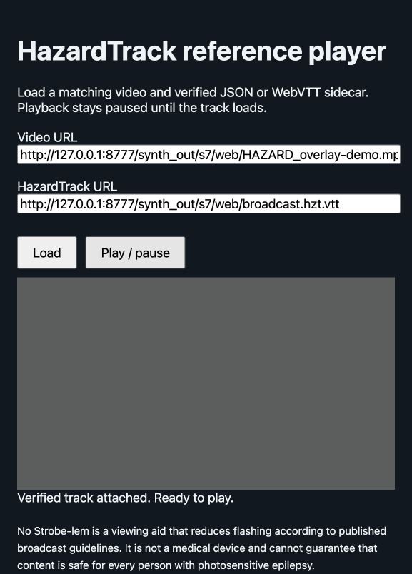

# Portable overlay validation

The browser fixture uses ten seconds of **constant gray**, deliberately adding
a nonminimal test veil. The real reference verifier accepts the input and the
veiled output at −268.875/0/+268.875 ms. It demonstrates overlay application;
it does not claim detection accuracy for hazardous content or calibrated browser
synchronization/compositing. The source hash and actual verification result are
in [web-fixture.json](s7/web-fixture.json).

Actual Codex in-app browser playback was exercised on macOS. The host bound the
source checksum, loaded the WebVTT metadata track, and enabled its Play button.
24 actual screenshots show opacity zero before the cue, ramping toward 0.6 and
holding at gray code 64. Sampling is irregular and is not a sync measurement.
The [capture](s7/web-overlay.mp4) preserves observed screenshot intervals; the
[observations](s7/web-overlay-samples.json) retain media/host times. A mismatched
contract fixture was then refused and the Play button stayed disabled.

`node scripts/test-web-reader.cjs` additionally checks all 500 shared timeline
samples, WebVTT with CRLF, overlap ties and failure/unresolved refusal. Native
Chrome and Firefox were not separately driven in this session. They are the
intended desktop hosts; browser-specific timing requires independent validation.
